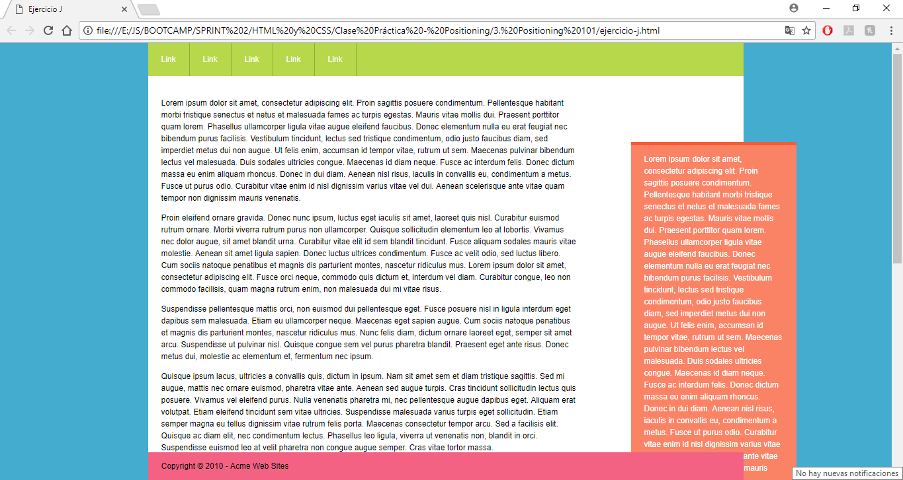

## Positioning 101

#### Descripción:
Este repositorio contiene doce ejercicios de CSS obtenidos de la página A LIST APART.

El último y más complicado de todos los diseños se ve así en el navegador:

  

#### Herramientas utilizadas:
* HTML
* CSS
